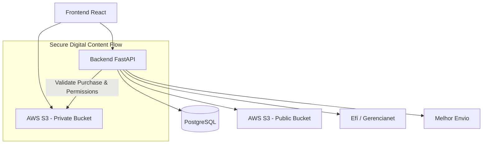

# Doce Ilusão – Hybrid E-commerce Platform

**Full-stack hybrid e-commerce solution** for physical products (with logistics) and protected digital content delivery (videos & PDFs).  

🇧🇷 Developed for the Brazilian market • Seeking remote/full-time opportunities abroad

**🔗 Live Store:** [https://doceilusa.store](https://doceilusa.store)

---

## 🚀 Live Demo

Experience the application in production:

**Store URL:** [https://doceilusa.store](https://doceilusa.store)

**Test Account (recommended):**
- **Email:** `teste@teste.com`
- **Password:** `123456`

You can also create a new account. Feel free to test the full user journey: product browsing, dynamic cart, real-time shipping calculation, and checkout flow.

> **Note:** This repository is **private** as I intend to commercialize the platform in the future.

---

## 🌟 Key Features

- Hybrid e-commerce solution supporting **physical products** (with logistics) and **secure digital delivery**.
- Dynamic shopping cart with real-time shipping calculation.
- Complete checkout with PIX and credit card payments via tokenization.
- Secure premium content delivery using AWS S3 pre-signed URLs.
- Idempotent stock reservation to prevent overselling.
- Admin dashboard structure for sales metrics and regional analytics (in progress).
- Role-based authentication with JWT and custom scopes (`basic`, `premium`, `admin`).
- Full integration with payment gateway and shipping provider.

---

## 💻 Tech Stack

### Frontend
- React 19 + TypeScript + Vite
- State Management: Zustand (client state) + TanStack Query (server state)
- Routing: React Router v7
- Styling: Tailwind CSS v4 + shadcn/ui

### Backend
- FastAPI (Python)
- Database: PostgreSQL (production) / SQLite (development) with SQLAlchemy ORM
- Cloud Storage: AWS S3 via boto3 (public bucket for images + private bucket for paid content)
- Authentication: JWT with scoped authorization + Bcrypt
- Integrations: Efí/Gerencianet (Payments) and Melhor Envio (Logistics)

---

## 🏗 Architecture

The backend acts as a secure intermediary: after purchase validation, it generates temporary pre-signed URLs allowing direct and secure streaming from the private S3 bucket.

📸 Screenshots
1. Homepage – Product Catalog

2. Product Details

3. Shopping Cart

4. Checkout Process

5. Admin Dashboard (in development)

Tip: Horizontal (landscape) images display better on GitHub.

📁 Repository Structure

DirectoryDescription/FrontendReact SPA application (see README_frontend.md)/BackendFastAPI backend (see folder README)

🚀 How to Run Locally
1. Backend (FastAPI)
Bashcd Backend

# Create and activate virtual environment
python -m venv venv
source venv/bin/activate        # Windows: venv\Scripts\activate

# Install dependencies
pip install -r requirements.txt

# Run the server
uvicorn app.main:app --reload
2. Frontend (React)
Bashcd Frontend

# Install dependencies and run
yarn install
yarn dev
Access:

API Documentation (Swagger): http://localhost:8000/docs
Store: http://localhost:5173

🛠 Technical Challenges Overcome

Secure digital content delivery without exposing files directly to the client.
Secure credit card tokenization (card data never stored permanently on our servers).
Real-time shipping rate calculation integrated with external logistics API.
Idempotent inventory management to ensure data consistency during concurrent purchases.
Strict separation between public and private S3 buckets with proper permission control.

📍 Roadmap

Complete Admin Dashboard with real sales metrics and analytics
Implement automated testing (unit + integration tests)
Improve SEO and frontend performance
Add coupon system and promotional features
Full Dockerization of the project

Thank you for visiting!
Feel free to reach out with any questions or feedback.
This project is part of my Full-Stack Developer portfolio. I am currently seeking new professional opportunities abroad.
text---

**Pronto!**  
Esta versão está mais técnica, fluida e com linguagem apropriada para recrutadores internacionais (EUA, Europa, etc.).

### Como usar:
1. Copie **todo** o texto acima.
2. Cole em um arquivo novo.
3. Salve como **`README.md`**

Quer que eu ajuste alguma parte (deixar ainda mais técnico, adicionar seção de "Performance Considerations", mudar o tom, etc.)? É só falar!
