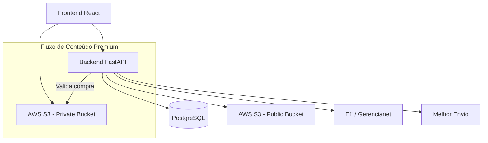

# Doce Ilusão – E-commerce Platform

**Plataforma completa de e-commerce híbrido** para venda de produtos físicos (com logística) e conteúdo digital protegido (vídeos e PDFs).

**🔗 Loja Online:** [https://doceilusa.store](https://doceilusa.store)

---

## 🚀 Demo ao Vivo

Experimente a aplicação em produção agora:

**Link da Loja:** [https://doceilusa.store](https://doceilusa.store)

**Conta de teste (recomendada):**
- **E-mail:** `teste@teste.com`
- **Senha:** `123456`

Você pode criar uma conta nova normalmente. Teste o fluxo completo: navegação, carrinho, cálculo de frete e checkout.

> **Observação:** Este repositório está **privado** porque pretendo comercializar a plataforma no futuro.

---

## 🌟 Principais Funcionalidades

- **E-commerce Híbrido**: Venda de produtos físicos (baralhos de mágica, etc.) + entrega segura de conteúdo digital.
- **Carrinho dinâmico** com Zustand e cálculo de frete em tempo real.
- **Checkout completo** com PIX e Cartão via Efí/Gerencianet.
- **Gestão segura de conteúdo premium**: Vídeos e PDFs protegidos com pre-signed URLs da AWS S3.
- **Reserva idempotente de estoque** para evitar vendas duplicadas.
- **Dashboard Admin** em desenvolvimento para métricas de vendas por região.
- **Autenticação** com JWT + scopes (`basic`, `premium`, `admin`).
- **Integração completa** com logística (Melhor Envio).

---

## 💻 Tech Stack

### Frontend
- React 19 + TypeScript + Vite
- Zustand + TanStack Query
- React Router v7
- Tailwind CSS v4 + shadcn/ui

### Backend
- FastAPI (Python)
- PostgreSQL (produção) / SQLite (desenvolvimento) + SQLAlchemy
- AWS S3 (boto3) – buckets públicos e privados
- JWT + Bcrypt
- Integrações: Efí/Gerencianet e Melhor Envio

---

## 🏗 Arquitetura

    
O Backend atua como intermediário de segurança: após validar a compra, gera URLs temporárias para acesso ao conteúdo privado.

📸 Screenshots
Aqui você pode ver a aplicação em produção:
### 1. Página Inicial 

### 2. Detalhes do Produto

### 3. Carrinho de Compras

### 4. Processo de Checkout

### 5. Dashboard Admin (em desenvolvimento)

📁 Estrutura do Repositório

DiretórioDescrição/FrontendAplicação React SPA (detalhes no README_frontend.md)/BackendAPI FastAPI (detalhes no README da pasta)

🚀 Como Rodar Localmente
1. Backend (FastAPI)
Bashcd Backend

# Crie e ative o ambiente virtual
python -m venv venv
source venv/bin/activate        # No Windows: venv\Scripts\activate

# Instale dependências
pip install -r requirements.txt

# Configure o .env (banco, AWS, etc.)
uvicorn app.main:app --reload
2. Frontend (React)
Bashcd Frontend

# Configure o .env (URL da API + chaves públicas da Efí sandbox)
yarn install
yarn dev
Acesse:

Swagger da API → http://localhost:8000/docs
Loja → http://localhost:5173

🛠 Desafios Técnicos Enfrentados

Implementação segura de entrega de conteúdo digital sem expor arquivos diretamente.
Tokenização de cartão de crédito (dados nunca ficam permanentemente no servidor).
Cálculo de frete em tempo real integrado com Melhor Envio.
Gerenciamento idempotente de estoque durante picos de vendas.
Separação clara entre buckets públicos e privados na AWS S3.

📍 Roadmap / Próximos Passos

Finalizar o Dashboard Admin com métricas reais
Implementar testes automatizados (unitários + integração)
Melhorar SEO e performance do Frontend
Adicionar sistema de cupons e promoções
Dockerização completa do projeto

Obrigado por visitar!
Qualquer dúvida ou feedback sobre o projeto, fique à vontade para entrar em contato.
Este projeto faz parte do meu portfólio como desenvolvedor full-stack. Estou em busca de oportunidades profissionais enquanto desenvolvo minha empresa de mágica.
